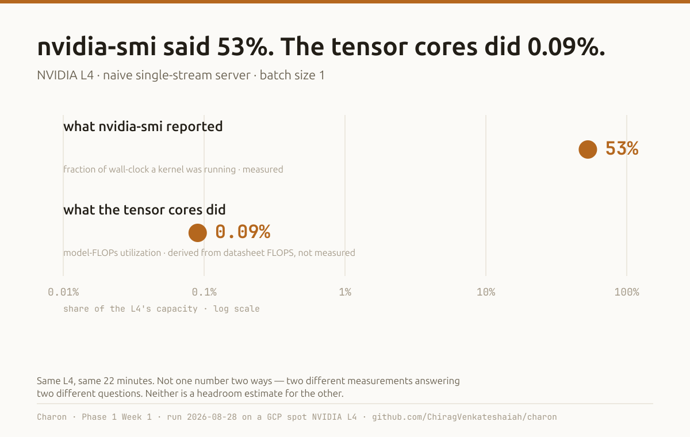
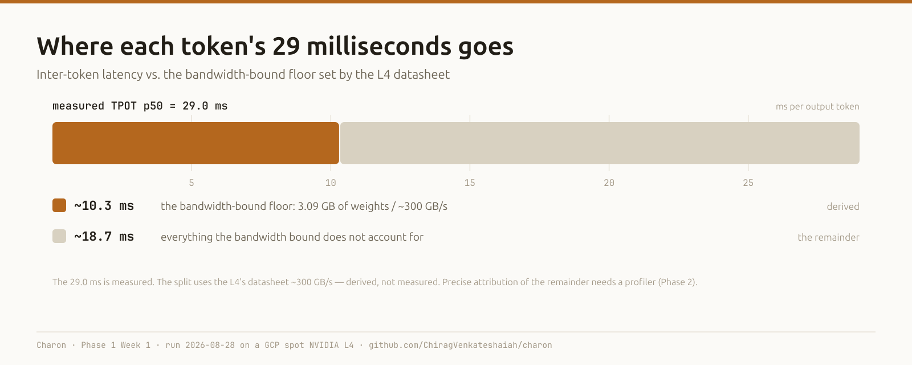
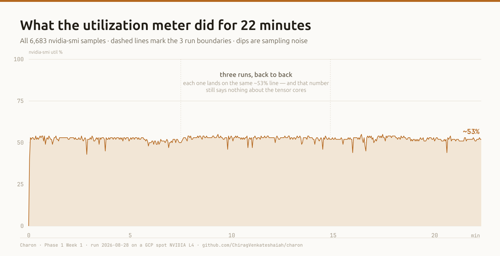
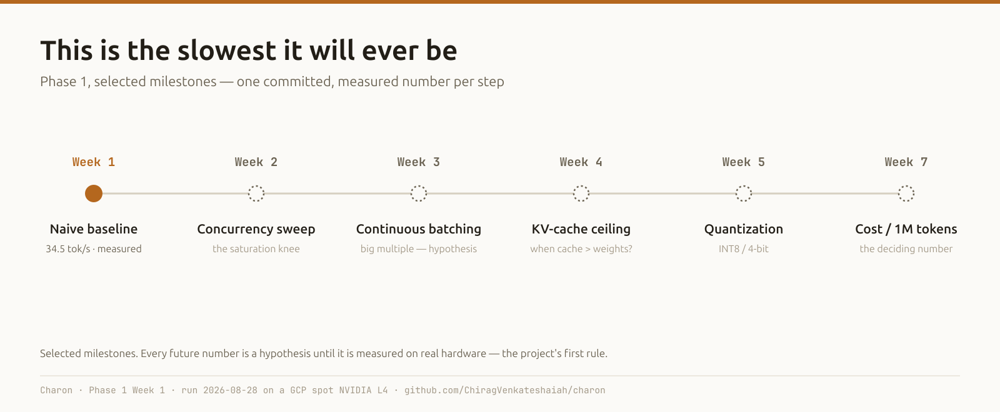

# I Measured My First LLM Inference Baseline. The GPU Was Barely Working — On Purpose.

*Charon, week 1: a naive single-stream server on an NVIDIA L4. The utilization meter said 53%. The tensor cores were doing roughly 0.09% of the arithmetic the datasheet says they can do. Both numbers are correct, and the gap between them is the whole point.*

---

## The one-sentence result

I put a 1.5-billion-parameter language model behind the simplest possible HTTP server and sent it 300 measured requests (360 total; 60 discarded as warmup) on a rented NVIDIA L4.

- **`nvidia-smi` reported 53% GPU utilization.** That's measured.
- **Model-FLOPs utilization — arithmetic delivered ÷ the L4's datasheet peak — was about 0.09%.** That's derived, not measured. The order of magnitude is solid.

| | p50 | p95 | p99 |
|---|---|---|---|
| Time to first token | 32.1 ms | 33.8 ms | 35.0 ms |
| Inter-token latency | 29.0 ms | 29.6 ms | 30.0 ms |
| End-to-end (128 tokens) | 3.71 s | 3.79 s | 3.84 s |
| Decode throughput | 34.5 tok/s | 35.3 | 35.5 |

That "0.09% of its compute" is not a bug. It's the baseline. Everything I build over the next seven weeks is a measured attempt to close that gap, and I can only prove it closed if I know exactly how wide it started.



---

## Why I'm doing this the slow way

This is week 1 of **Charon**, an eight-week project to develop real intuition for what happens between an inference request arriving and a token coming back. Not a platform. Not a product. A sequence of controlled measurements, each producing one number I can defend.

The project has one governing rule, written down before any code: **every phase must produce a new measured number, recorded with its raw output, before that phase is done.** No number, no progress. A benchmark script with placeholder values doesn't count. A vendor's throughput chart doesn't count. Only a result produced on hardware I paid for, reproducible from a committed config.

That rule exists because performance work has a large surface of *plausible activity* — reading about batching, scaffolding a harness, comparing serving stacks on paper — that feels like progress and produces nothing an interviewer can probe. The thing that reads as senior is a causal story: *it was doing X, the bottleneck was Y, I changed Z, now it does 3X.* You can't tell that story without X.

So week 1 is X.

---

## The setup: a deliberately bad server

The week 1 server is the *worst reasonable implementation*, on purpose:

```python
# one request at a time — this lock is the naive part
with _GEN_LOCK:
    out = model.generate(
        **enc,
        min_new_tokens=n, max_new_tokens=n,   # forced length, comparable runs
        do_sample=False,                       # greedy, reproducible
        logits_processor=[timer],              # per-token timestamps (see below)
    )   # (elided — full call in serving/naive_server.py)
```

Plain Hugging Face `transformers.generate`, one request at a time behind a global lock, wrapped in a minimal FastAPI endpoint. No batching. No continuous batching. No paged attention. No `torch.compile`. No quantization.

Every one of those omissions is a later week. You cannot measure what continuous batching buys you without a number for what life is like without it.

The server measures its own per-request timing inside the process with `perf_counter`, so client-side network latency never contaminates the numbers. Per-token timestamps come from a `LogitsProcessor` callback — which means **my own timing instrument sits inside the measured window and costs a few hundred microseconds per token.** That's measured cost, by design; I'd rather have honest per-token data with a small known overhead than clean-looking data I can't decompose.

**The model:** `Qwen/Qwen2.5-1.5B-Instruct`, pinned to commit `989aa7980e4cf806f80c7fef2b1adb7bc71aa306`, bfloat16. Apache 2.0, plain instruction-tuned, no "thinking" mode to complicate token accounting. Pinned by hash, not tag, because a benchmark you can't reproduce is a story you can't defend — and because week 6 moves to the 7B sibling in the same family, so scale becomes the only variable that changes.

---

## The setup: the stack, the hardware, and two things that bit me

**Pinned in a `uv` lockfile:**

| Package | Version |
|---|---|
| torch | 2.13.0+cu130 |
| transformers | 5.16.1 |
| accelerate | 1.14.0 |
| fastapi / uvicorn | 0.141.1 / 0.52.4 |

**The GPU:** one NVIDIA L4 — Ada Lovelace, compute capability 8.9, 24 GB GDDR6. Datasheet figures I lean on later: **~300 GB/s memory bandwidth**, **~121 dense bf16 TFLOPS** (the 242 TFLOPS marketing number is with sparsity; I halve it and label the caveat). 72 W. I did not measure bandwidth or FLOPS — those are NVIDIA's numbers, labelled as such every time they appear.

**The host:** a GCP `g2-standard-4` (4 vCPU, 16 GB) — **spot**, in `us-central1-c`, on a Deep Learning VM image (`common-cu129-ubuntu-2204-nvidia-580`, driver 580.173.02).

**The cost:** roughly **₹42/hour all-in** (≈ $0.50 at ~₹84/USD) at GCP list price, from the billing catalog on 2026-08-28 — L4 spot ₹32.13/hr + vCPU + RAM + a small disk charge. That is a list price, checked once, not a benchmark result; against my ~₹1,000/month working budget it's about 24 GPU-hours, which is why the discipline below matters.

**The discipline:** the GPU is powered on only while a measurement is actively running. Development, analysis, and writing all happen on my laptop's CPU. The instance is created and deleted per session by two scripts — never left stopped, because a stopped instance's disk still bills.

**Two version-drift problems** cost me time, and both are the kind of thing that bites anyone doing GPU infra:

1. **`transformers` renamed generation and loading kwargs somewhere between the version my mental model was built on and 5.16.1.** `torch_dtype=` became `dtype=`; the `StoppingCriteria` return contract changed shape. Which exact minor release doesn't matter — the point is that recalled APIs for a fast-moving library go stale, and the server now tries the new name and falls back to the old.
2. **`torch` 2.13 ships CUDA 13 runtime libraries** via pip wheels — so it doesn't need a CUDA toolkit on the host, but it *does* need an NVIDIA driver new enough for CUDA 13 (roughly R580+). My first choice of base image shipped an R550-era driver, and `torch.cuda.is_available()` would have returned `False`. I caught this by reading the lockfile's dependency tree, before spending a GPU-minute on it.

**Real friction getting the instance up**, because it's part of the honest picture: `us-central1-a`, `us-central1-b`, and `asia-south1-a` all returned "spot capacity unavailable" — the fourth zone took it. The DLVM image family I'd wired in had been retired. And my first run died at 90% complete to an over-tight timeout on the SSH command driving it; the runner writes its results file only after all runs finish, so there was nothing to salvage. I re-ran it as a detached process I polled from my laptop instead of a connection I held open. The measurement was unaffected; I just paid for the wall-clock twice. Total GPU time for the session: about **1.1 hours** — most of it the friction, not the measurement.

---

## The method

Seven rules, fixed before the first run and not changed between runs:

1. **Fixed input and output token counts.** `min_new_tokens == max_new_tokens == 128`. (Input length varied 41–49 tokens across a small prompt set — close; the canonical set for week 2 will fix it exactly.)
2. **Discard warmup.** First 20 requests of each run dropped.
3. **Percentiles, not averages.** p50 / p95 / p99 on every metric.
4. **Three runs minimum**, report the spread.
5. **Record the environment every time.**
6. **One variable per experiment.**
7. **Commit the raw output** — all 360 request records and 6,683 `nvidia-smi` samples are in the repo.

**On spread:** p50 spread came in at ~1% on every metric. But that's the p50 figure, and my runner currently only gates on p50 spread — **TTFT p99 spread was 18%**: one of the three runs had a slow first-token tail (41 ms vs 35 ms) I haven't explained. Small in absolute terms, every other metric's p95/p99 spread under 3%, but it's real and the harness should catch it. Gating on p99 spread is a week-2 fix.

One thing that *did* hold up: `peak_vram_bytes` was **bit-identical across all three runs** — exactly what greedy decoding at a forced length should produce, and decent evidence the harness is deterministic.

---

## Reading it, part 1: decode should be memory-bound — this server never even gets there

Generating one token means reading *every weight in the model* out of GPU memory once. Nothing about batch-of-one changes that — the same weights stream through for token 1 and for token 128.

So the ceiling on decode throughput is set by bandwidth, not compute:

```
~300 GB/s  ÷  3.09 GB of weights  ≈  97 tokens/second     (derived from the L4 datasheet — not measured)
```

Measured: **34.5 tok/s, about 36% of that ceiling.** Inter-token latency is 29.0 ms against a bandwidth-bound floor of ~10.3 ms — so **~18.7 ms per token, roughly two-thirds of the budget, is time the bandwidth bound doesn't account for.**



At 36% of the memory ceiling with two-thirds of the token outside the transfer, this server is **launch-overhead-bound, not bandwidth-bound.** Decode only becomes memory-bound in a regime — fused kernels, CUDA graphs, or a real batch — that this server never reaches.

Attributing that 18.7 ms precisely needs a profiler (Nsight or the PyTorch profiler, phase 2). The plausible contributors: hundreds of small unfused kernel launches per token, the Python generation loop, my `LogitsProcessor` callback, sampling, cache bookkeeping, CPU↔GPU sync between steps. And the 10.3 ms floor is a *lower bound*, not a serial stage — memory transfer overlaps with compute and launch latency rather than queueing behind it.

---

## Reading it, part 2: what "53% utilization" does and doesn't mean

The project plan predicted GPU utilization "somewhere around 10–30%." I measured 53%. That looks like the plan was wrong. It isn't — the two numbers measure different things, and this distinction matters more than the result.

**`nvidia-smi` "GPU utilization" is a busy-time percentage** — the fraction of the sampling window during which *at least one kernel was executing*. This matches NVML's own definition. 53% means that for roughly half of each request's wall-clock, a kernel was running; the other half the GPU sat idle waiting on Python and on synchronization.

It says nothing about **how much of the GPU's parallel capacity those kernels used.** For that you compute model-FLOPs utilization:

```
forward FLOPs ≈ 2N per token  (N = 1.54B params; the tied LM head is a real matmul, the input embedding is a gather)
2 × 1.54e9 × 34.5 tok/s  ≈  0.11 TFLOP/s  ÷  ~121 TFLOPS (L4 dense bf16, datasheet)  ≈  0.09%
```

*(Ignores attention — small at a 128-token context. Order of magnitude is the point.)*

Both numbers are true. The GPU is "busy" ~53% of the time and delivering **~0.09%** of its arithmetic. Two independent measurements — 53% busy-time and 36% of the bandwidth ceiling — even roughly corroborate that the GPU is doing "about a third to a half of *something*"; the FLOPs estimate says the *something* is nowhere near arithmetic. A batch of one is simply not a compute workload. The tensor cores that make an L4 worth renting are almost entirely idle, because decode never assembles a batch big enough to make the matrix multiplies compute-bound.

That is the entire economic argument for batching, and I now have the number that proves I need it.

---

## Reading it, part 3: the memory nobody is using

Peak VRAM was **~3.2 GiB of 22.5 GiB** (`nvidia-smi mem.used`) — weights, a tiny 128-token KV cache, activations, framework overhead. **About 86% of the L4's memory sat empty** for the whole run.



That headroom is not waste to be trimmed. It's the room that batching and longer contexts will fill in weeks 3 and 4 — and computing, on paper, how many concurrent sequences a given model and context length will fit is one of this phase's exit conditions.

---

## What's next



- **Week 2 — the concurrency sweep.** Same server, concurrency 1 → 64. Throughput rises then plateaus; p99 latency rises gently then explodes. The inflection is the saturation point. I want to state this server's saturation concurrency and what limits it.
- **Week 3 — batching.** Naive static batching, then a continuous-batching server (vLLM or TGI), same model, full sweep. I *expect* a large throughput multiple and — counterintuitively — often *better* p99 under load, because continuous batching doesn't make short requests wait for long ones. That expectation is a hypothesis until it's a committed number.
- **The open question I can't answer yet:** on this model, at what context length does the KV cache overtake the weights as the dominant memory consumer? That's week 4, and it's the number that decides how many concurrent users a given instance can actually hold.

Weeks 5–7 then cover quantization as a memory optimization first and a speed one second, the 7B model where constraints bind differently, and finally cost per million tokens for every configuration — on-demand versus spot, idle time included.

Every future number is a hypothesis until it's measured on hardware. That's the rule, and I flag it every time I write one down before I've earned it.

---

## Reproducibility

The repo is at **github.com/ChiragVenkateshaiah/charon**. The model revision is pinned by hash, the dependencies by lockfile, and the full raw output of this run — every request, every GPU sample — plus the script that drew every chart in this post is committed under `benchmarks/results/` and `Articles/`. The environment is recorded in the result file — *except* the driver version and `nvidia-smi` detail, which I filled in by hand this time and am wiring into the server's health check for week 2.

I'm building this with AI assistance under a written working agreement that keeps architecture decisions and the "why" with me, delegates implementation and debugging, and forbids asserting any performance number that wasn't measured on real hardware in the project. That constraint is why every derived number in this post is labelled.

---

## The thesis

A naive server makes an expensive GPU look half-busy while it delivers a thousandth of its compute. This is the slowest Charon will ever be. Next week I start making it faster — and measuring exactly how much.

*If you want to follow the whole arc, subscribe. One measured number a week.*
