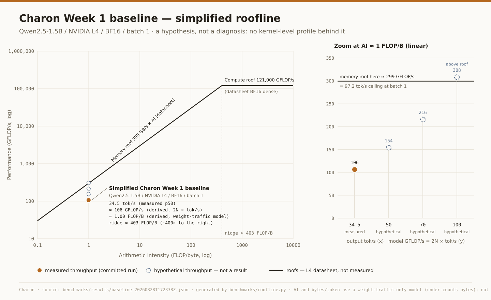

# Week 1 — simplified roofline

A roofline reading of the Week 1 naive baseline, done while studying the
roofline model (Fregly, *AI Systems Performance Engineering*, ch. 2).

- **Source run:** [`benchmarks/results/baseline-20260828T172338Z.json`](../benchmarks/results/baseline-20260828T172338Z.json)
  — the only measured input. Week 1 writeup:
  [`2026-08-28-week1-baseline.md`](../benchmarks/results/2026-08-28-week1-baseline.md).
- **Not a result in itself** (ADR-0001). This is arithmetic over one committed
  run, two datasheet figures and a simplified traffic model. It produces **no
  new measured number**. Its output is a hypothesis that tells us what to profile.
- **Regenerate:** `python3 benchmarks/roofline.py` (stdlib only) rewrites
  [`week1-roofline.svg`](week1-roofline.svg) and prints the tables below.
  Checks: `python3 -m unittest benchmarks/test_roofline.py`. Inputs and their
  provenance: [`benchmarks/roofline-week1.json`](../benchmarks/roofline-week1.json).

> **Roofline hypothesis, not diagnosis:** the simplified baseline suggests that
> data movement / memory behavior may be important, but kernel-level profiling
> is required before selecting an optimization.

## Inputs and derived values

Each value has one of five kinds. **measured** values are read from the
committed result file by key path, never typed into config. **datasheet**
values are vendor peaks that weren't measured here. **assumption** values are
modelling choices or owner-supplied rates. **derived** values are arithmetic
over the above and carry their caveats. **hypothetical** values are what-if
throughputs.

| Quantity | Value | Kind | Basis |
|---|---|---|---|
| Decode throughput, p50 | 34.50 tok/s | measured | `summary.across_runs.decode_tokens_per_s.p50.median` |
| TPOT, p50 | 29.0 ms | measured | `summary.across_runs.tpot_s.p50.median` |
| TTFT, p50 | 32.1 ms | measured | `summary.across_runs.ttft_s.p50.median` |
| End-to-end (128 tok), p50 | 3.713 s | measured | `summary.across_runs.e2e_s.p50.median` |
| GPU utilization (`nvidia-smi` busy-time), p50 | 53 % | measured | `summary.gpu.util_gpu_pct.p50` |
| Weights in VRAM | 3.087 GB | measured | `environment.healthz.weights_vram_bytes` |
| VRAM used (max) | 3.244 GB of 23.0 GB | measured | `summary.gpu.mem_used_mb_max` |
| Peak BF16 compute | 121 TFLOP/s | datasheet | L4, dense tensor core (242 with sparsity) |
| Memory bandwidth | 300 GB/s | datasheet | L4 |
| Parameters N | 1.54 B | assumption | published count. Matches weights ÷ 2 B/param = 1.5437 B |
| FLOPs per token | 3.08 GFLOP | derived | 2 × N (attention-score FLOPs ignored; small at 128 ctx) |
| Bytes per token | 3.087 GB | derived | = weights. Weight-traffic-only model, **under-counts** |
| Arithmetic intensity (AI) | 0.998 ≈ 1 FLOP/B | derived | FLOPs/token ÷ bytes/token |
| Ridge point | 403.3 FLOP/B | derived | 121 TFLOP/s ÷ 300 GB/s |
| Model FLOP/s | 106.3 GFLOP/s | derived | 2 × N × 34.5 tok/s |
| MFU | 0.088 % | derived | 106.3 GFLOP/s ÷ 121 TFLOP/s |
| Weight-traffic rate | 106.5 GB/s | derived | 34.5 tok/s × 3.087 GB. **Not measured DRAM bandwidth** |
| Memory roof at AI ≈ 1 | 299.3 GFLOP/s | derived | 300 GB/s × 0.998 FLOP/B |
| Baseline as % of that roof | 35.5 % | derived | 106.3 ÷ 299.3 |
| Batch-1 bandwidth ceiling | 97.2 tok/s | derived | 300 GB/s ÷ 3.087 GB/token |

## Hypothetical throughputs and economics

Model FLOP/s = 2 × N × tok/s. The hypothetical rows **are not results**. All
four rows sit at the same AI ≈ 1, because they keep the batch-1 premise of
reading the full weight set once per token.

| Throughput (tok/s) | Kind | Model GFLOP/s | Above the batch-1 memory roof? | ₹ / 1M output tokens @ ₹69/h |
|---|---|---|---|---|
| 34.5 | measured | 106.3 | no | ₹555.58 |
| 50 | hypothetical | 154.0 | no | ₹383.33 |
| 70 | hypothetical | 215.6 | no | ₹273.81 |
| 100 | hypothetical | 308.0 | **yes** | ₹191.67 |

`cost_per_1M = hourly_rate / (3600 × tok/s) × 1,000,000`

- **The ₹69/h rate was supplied by the owner on 2026-10-05 as the observed
  effective rate.** It isn't traced to a committed billing record and isn't
  a guaranteed GCP price. It also differs from the ~₹41.9/h spot list price in
  [`gcp-setup.md`](gcp-setup.md#cost). That gap is unreconciled. At ₹41.9/h every
  row would be about 0.61× as large.
- **The table assumes 100% duty.** Every billed second is spent generating at
  that rate, with no idle time, no setup and no prefill. Real cost per token is
  higher.
- **The 34.5 tok/s row comes from one stream at concurrency 1.** For
  economics, the number that matters is *aggregate* tok/s across concurrent
  requests, and Week 2 measures that.
- **100 tok/s is above the memory roof under this model.** At batch 1 and
  BF16 the ceiling is ~97 tok/s. You don't reach 100 tok/s by making the same
  work faster. You need fewer bytes per token (quantization) or more tokens
  per byte read (batching), and both move the point *right*, not straight up.
  That is the more useful lesson of this table.

## Interpretation

**Why the baseline sits far left of the ridge.** At batch 1, each BF16 weight
(2 bytes) is read once and takes part in one multiply-add (2 FLOPs) per token.
So under this model AI ≈ 1 FLOP/B *by construction*. The ridge is at ~403
FLOP/B, about 400× further right. The simplified model says that at batch 1
there is only ~1 FLOP of work for every byte moved. To use the compute roof at
all, each weight byte would need ~400 FLOPs of reuse.

**Why this does not prove DRAM bandwidth is saturated.** Being left of the
ridge tells you which roof is *the ceiling*. It does not tell you the ceiling
is being hit. The baseline is at **35.5% of the memory roof**. If DRAM bandwidth
were the binding limit, the point would sit on the roof line. About 64% of each
29 ms token is time the bandwidth floor (~10.3 ms) does not explain. The Week 1
writeup attributes that time to launch overhead. That explanation is consistent
with the data but **unprofiled**, so it is also a hypothesis.

**Why the ~106 GB/s figure must not be called measured bandwidth.** It is
*measured tok/s × assumed bytes/token*. No memory counter produced it.
- It under-counts traffic because it ignores KV-cache, activation and logits
  reads and writes.
- It can't see bursts. A kernel can run near peak bandwidth for part of a step
  and sit idle for the rest, and the average would still read ~106 GB/s.
- `nvidia-smi utilization.memory` (51%) is a busy-time fraction, not GB/s.
- Achieved DRAM bandwidth needs Nsight Compute.

**Why low MFU does not mean "buy more compute".** MFU of 0.088% means the
tensor cores are almost idle. The compute roof is ~400× in AI away from where
the server runs, so a bigger GPU raises a roof we never touch. More peak FLOPs
can't help work that offers ~1 FLOP per byte. The cost lever is more useful
tokens per GPU-second: raise AI through batching, cut bytes through
quantization, and close the 64% gap below the memory roof. All three are
hypotheses for Weeks 2–5 to measure.

**What's needed to tell the candidate bottlenecks apart:**

| Candidate | What would show it | Tool |
|---|---|---|
| Kernel launch overhead | many short kernels per decode step, with idle gaps between them on the GPU timeline | Nsight Systems / `torch.profiler` |
| CPU orchestration (Python loop, logits processor) | GPU idle while the CPU thread is busy between steps | Nsight Systems (CPU+CUDA rows) |
| Synchronization | `cudaStreamSynchronize` / `.item()` stalls once per step | Nsight Systems |
| DRAM bandwidth | dominant GEMV kernels at a high % of peak `dram__throughput` | Nsight Compute |
| Memory latency | low DRAM throughput with long-scoreboard / memory-dependency stalls | Nsight Compute (warp-state stats) |
| Insufficient parallelism / occupancy | few CTAs per GEMV, low achieved occupancy, partial waves across the SMs | Nsight Compute (launch stats, occupancy) |

## Measured / Derived / Unknown

| | |
|---|---|
| **Measured** | tok/s, TPOT, TTFT, e2e, `nvidia-smi` busy-time, weights and VRAM bytes (all from the one committed run) |
| **Derived** | AI, FLOP/s, MFU, weight-traffic rate, % of memory roof, batch-1 ceiling, ₹/1M tokens |
| **Unknown** | achieved DRAM GB/s, kernels per token, GPU idle-gap breakdown, CPU time per step, achieved occupancy, stall reasons. Without these, *what bounds this server is unknown.* |

## What Charon optimizes

Neither "maximize GPU utilization" nor "maximize TFLOPS" is the objective.
`nvidia-smi` already reads 53% while the tensor cores do 0.09%, so both are easy
to inflate without serving anyone better.

**Objective: maximize useful, SLA-compliant inference throughput per unit cost.**

Every configuration is tracked on:
- output tok/s (aggregate)
- TTFT and TPOT
- p50/p95/p99 latency
- GPU utilization and memory behavior (supporting metrics, not targets)
- quality / SLO compliance when available
- cost per request, per output token and per 1M output tokens

A roofline position matters only if moving it changes one of those numbers.
